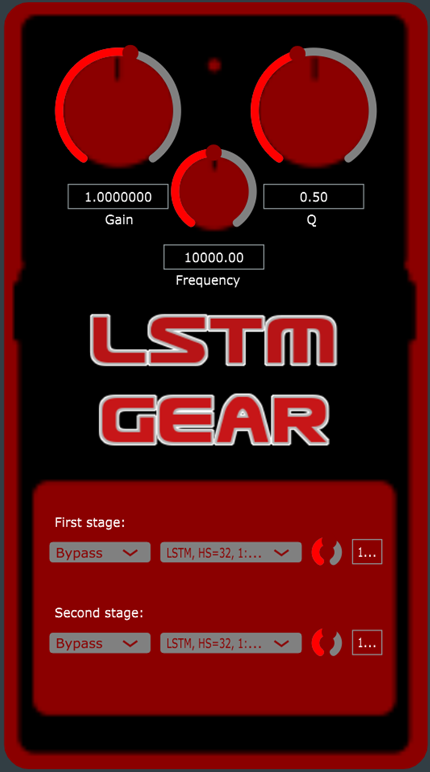

# LSTM GEAR
The goal of this project is to create a working plugin that emulates electric guitar effects using neural models in C++ through blackbox modelling of analog pedals. At the same time this plugin is intended to implement a chain of the above mentioned effects.

  <picture>
    
  </picture>

# SETUP
The project was done on Windows OS and is built using CMake. **It is necessary to create a folder
for the project that contains another folder with source files, CMakeLists.txt, images files,
.json models and README.md.** Training has already been done. You need to include in the
CMakeLists.txt the RTNeural library - explained later - and save it locally on the PC. **Be sure to change
the path before running the build, as well for the JUCE path.**
The src folder contains the PluginProcessor.cpp and PluginProcessor.h files. In addition there are also
the PluginEditor.h and PluginEditor.cpp files to make it possible to develop a GUI for our plugin. Only
.cpp files have been added to the target sources. It was also necessary to add in the private part of the
target link libraries JUCE’S DSP module: it allows to define and use DSP processes quickly.
An external sound card to connect the guitar is required with a low buffer size setup (for latency issues) and a sampling frequency of 44.1 kHz. Once all this is done it will be possible to build the project
using the command **”cmake -B build”** via terminal, after being positioned in the project folder. **Also
remember to change the paths of the models in .json format (explained later) in PluginProcessor.cpp
and of the .png files loaded by the PluginEditor.cpp.**
Check out **INSTRUCTIONS.txt.**

# LINK VIDEO:
https://www.youtube.com/watch?v=GoWgHEdeOak

# REPORT
The description of the code and its technical evaluation has been summarized in a report. Take a look at the LSTM GEAR.pdf file
